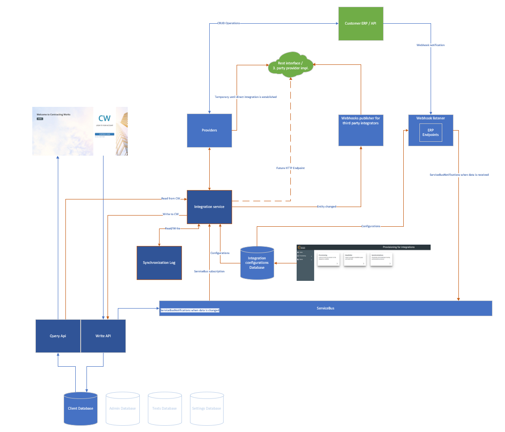

# Integration services

## Components

Below follows a basic overview of the components used for and by the integration service.

### Contracting Works

#### Query/GraphQL API

To query the Contracting Works database we use a GraphQL interface.

#### Write API

 We use the Write API to update and create Contracting Works objects.

#### Client Database

SQL Server is used for persisting the data entered through the Write API and reading the data using GraphQL

### ServiceBus

An Azure ServiceBus is used to send commands to the integration service, either from Contracting Works itself or via webhooks on the 'outside'.

### Synchronization Log

Synchronization log keeps track of what has been synchronized between the provider and Contracting Works.

### Integration Configuration Database

Integration configuration database is a simple dictionary database: Given a Client identifier we lookup the connection string for the provider used by the client.

### Integration Service

Integration service is the heart or engine that makes the integrations work. It monitors the service bus for updates and reacts to changes.

##### Scenario 1

An invoice is created by a user working in the frontend.

After the invoice is created it triggers an event that is put on the service bus together with a client identifier.

The event is picked up by the integration service.

The correct provider is instantiated which in this case would be an invoice provider for the ERP system configured for the client.

The invoice is converted to the required format and then published to the ERP system used for the client.

###### Side effects

When we created the invoice in the ERP system it might trigger an event on its side making it call our webhook informing us that something has changed, as we already know that this invoice was created from CW this event will just be ignored.

##### Scenario 2

...

### Providers

A provider here is a mapping from the context of CW to the context of another system together with operations.

As a first step we will have three providers hardcoded into the system (Visma Net, UniEconomy and Tripletex).

TODO: The idea is that instead of using in-place assemblies for these providers we should instead publish HTTP endpoints that implement a specific REST interface.

### Admin GUI

##### Provisioning

Provider configuration per client

##### Provider administration

Setup a new provider to be used. Typically done by 3rd party integrators.

More information will follow.

They would have to implement a REST Interface which will be described later.

### Webhooks Publisher for 3rd party integration

### Webhook Listener

### Customer API (ERP etc.)

Typically a REST interface to a 3rd party system that we integrate with. Now we are connecting directly to this from a specific assembly provider but this should be replaced by a common REST interface, see Providers above.
