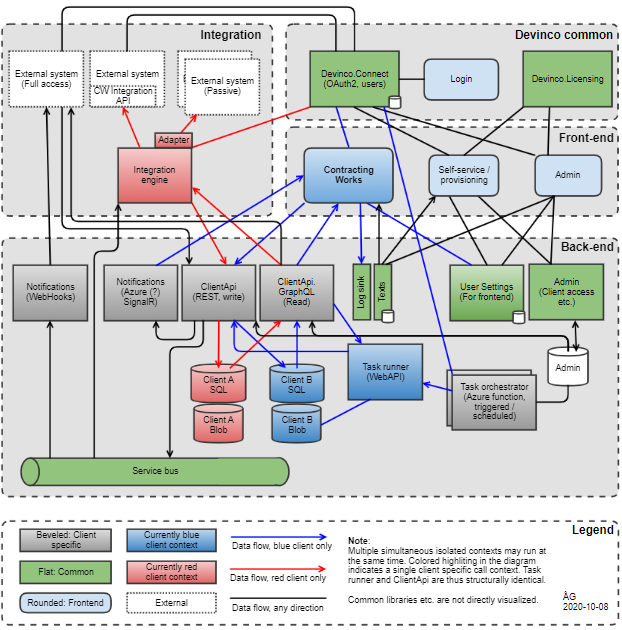

# Architecture Overview
Contracting Works consists of multiple modules, which can roughly be grouped into back-end, front-end, integration and Devinco common functionality. In addition to the main modules displayed here, common functionality such as authorization is grouped into several internal libraries.

## Modules

| **Module**                           | **Type**           | **Description**                                              |
| :----------------------------------- | :----------------- | :----------------------------------------------------------- |
| Notifications (Webhooks)             | Webhooks           | Webhook service provides aggregate root level change events for all client data changes. |
| Admin (UI)                           | Web UI             | User interface for Admin (Back end).                         |
| Self-service / provisioning          | Web UI             | User interface for onboarding new users / clients, and for administering existing users / clients. Intended for client administrators. |
| Task orchestrator                    | Azure Function     | Triggers relevant client specific tasks. Relevant client specific bearer token (OAuth) is fetched from Devinco.Connect, and provided to the task runner which performs the actual task. Multiple task orchestrators may exist for different tasks. |
| Texts                                | WebApi             | Text service provides language and branch translations (e.g. plumbers and electricians may use different terms for the same concepts - branch specific texts are then provided here) |
| Integration engine                   | -                  | Sync engine for all CW integrations owned by the CW integration team + external systems implementing the CW Integration API. Consists of multiple internal parts, including Azure Functions, Azure SQL database and WebApi services. Described separately here: |
| Service bus                          | Azure ServiceBus   | Standard Azure service bus, providing guaranteed delivery change notifications. Mainly used by integrations and web hooks. Change notifications are grouped on the aggregate root level to prevent event storms during data import, integrations or migrations of data. |
| Notifications (SignalR)              | SignalR            | SignalR service providing change events for all client data changes. Allows frontend “dirty” flags or notification behavior for handling concurrent users. |
| Task runner                          | WebApi             | Runs automated tasks for a specific client. Multiple task runners may exist for different tasks. Example: price and rebate imports. |
| ClientApi                            | WebApi             | Main client API for mutating data. REST based, generated from SqlDbm source model + aggregate definitions. |
| ClientApi.GraphQL                    | WebApi             | Main client API for reading data. GraphQL based, generated from SqlDbm source model + aggregate definitions. |
| Contracting Works                    | Web UI             | Main frontend for clients.                                   |
| Login                                | Web UI             | Login screen provided by Devinco.Connect for interactive user logins. |
| Log sink                             | WebApi             | Incoming technical log sink for use from front-end or external parties. Allows full chain log analysis by a common correlation ID. |
| User settings                        | WebApi             | Front end user settings (NO SECRETS!). E.g. language preferences, color scheme, grid layout etc. |
| External system (CW Integration API) | Web service (REST) | External services implementing the CW integration API. When implementing the API, the external system integration is handled as if it was an integration developed by the CW integration team, e.g. sync engine behavior, logging, statuses etc. behave identically. |
| External system (Passive)            | Web service        | External services integrated with by the CW integration team by consuming external system APIs. |
| External system (full access)        | -                  | External partners granted leave to use the full CW API: ClientApi, ClientApi.GraphQL, log sink and Notifications. |
| Admin SQL                            | Azure SQL DB       | DB for Admin (Back end). This database is directly accessed by the Lib.Auth library for performance reasons. |
| Devinco.Connect                      | WebApi             | Common OAuth2 service, used by all CW system modules.        |
| Devinco.Licensing                    | WebApi             | Common license and billing information service.              |
| Client Blob                          | Azure BlobStore    | Client specific blob store for all client documents and files. |
| Client Sql                           | Azure SQK DB       | Client specific SQL database for all structured client data, including user roles and permissions. |
| Admin (Back end)                     | WebApi             | CW Clients (Tenants) including connection strings for the client SQL db and blob store.User mapping to tenants.System and tenant admin roles for users. |
